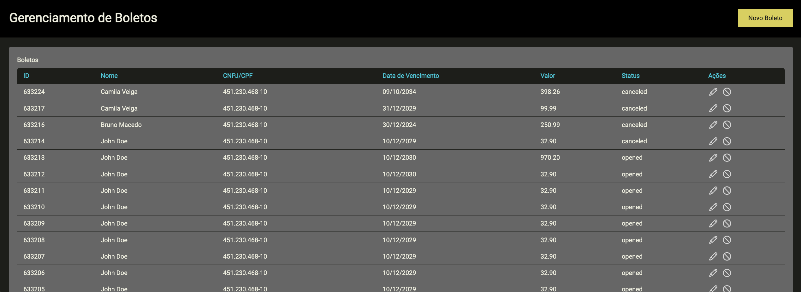

# Bank Slip Management

Ruby on Rails application to manage Bank Slips.



## Functionality

- I can see all the bank splips on the list in an overview.
- I can add a bank slip.
- I can edit a bank slip.
- I can cancel a bank slip.

## Enviroments

Change the ENV['BOLETOSIMPLES_API_TOKEN'] on configs to your api token.
https://app-sandbox.kobana.com.br/users/sign_in

## Running the app

Clone this repo:

```
$ git clone https://github.com/brunoreis-dev/bank-slip-management.git
```

Install all dependancies:

```
$ bundle install
```

Start memcache at localhost: 11211:

- install memcache on your machine and run this command for create a memory cache with dalli

```
$ memcached -p 11211
```

Start the server:

```
$ rails server
```

And open the app in your browser at http://localhost:3000.

## Interactive Console

Open Console:

```
$ rails console
```

## Testing the app

Run the tests:

```
$ rake
```

## Useful documentation

- [Ruby on Rails guides](http://guides.rubyonrails.org/)
